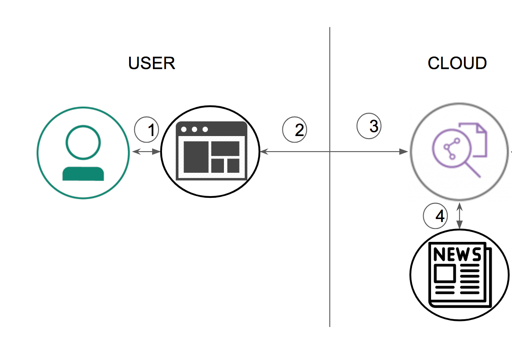
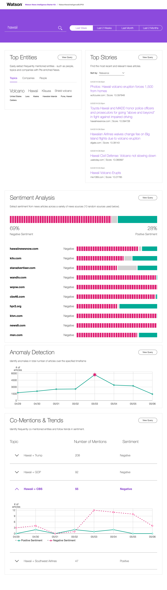

<!--Put badges at the very top -->
> Note: We don't need no stinkin' badges. We don't CI this or track deployments.

> TODO: Should we add travis and run the included tests if they work?

# Watson News Intelligence starter kit

> TODO: Reverse engineer and document:
   * what the kit does (intro and overview)
   * goals
   * architecture
   * flow
   * components used, featured tech
   * sample output
   * troubleshooting tips
   * links
   * add section(?) to refer to the actual starter kit

In this Code Pattern, we will [create something] using [technologies] and [components]. [Explain briefly how things work]. [Give acknowledgements to others if necessary]

When the reader has completed this Code Pattern, they will understand how to:

* [goal 1]
* [goal 2]
* [goal 3]
* [goal 4]



## Flow
1. Step 1.
2. Step 2.
3. Step 3.
4. Step 4.

<!--Update this section-->
## Included components
Select components from [here](https://github.ibm.com/developer-journeys/journey-docs/tree/master/_content/dev#components), copy and paste the raw text for ease
* [Component](link): description
* [Component](link): description

<!--Update this section-->
## Featured technologies
Select components from [here](https://github.ibm.com/developer-journeys/journey-docs/tree/master/_content/dev#technologies), copy and paste the raw text for ease
* [Technology](link): description
* [Technology](link): description

# Watch the Video
> We don't do videos for starter kits, right?

# Steps
Use the ``Deploy to IBM Cloud`` button **OR** create the services and run locally.

## Deploy to IBM Cloud

[](https://bluemix.net/deploy?repository=https://github.com/markstur/skit-watson-news-intelligence)

1. Press the above ``Deploy to IBM Cloud`` button and then click on ``Deploy``.

2. In Toolchains, click on Delivery Pipeline to watch while the app is deployed. Once deployed, the app can be viewed by clicking 'View app'.

3. To see the app and services created and configured for this Code Pattern, use the IBM Cloud dashboard. The app is named `WatsonNewsIntelligence` with a unique suffix. The following services are created <!-- and easily identified by the `wbc-` prefix -->:
    * watson-news-intelligence-discovery-1525714616589

## Run locally
> NOTE: These steps are only needed when running locally instead of using the ``Deploy to IBM Cloud`` button.

1. [Clone the repo](#1-clone-the-repo)
2. [Create Watson services with IBM Cloud](#2-create-watson-services-with-ibm-cloud)
5. [Configure credentials](#5-configure-credentials)
5. [Run the application](#6-run-the-application)

### 1. Clone the repo

Clone the `skit-watson-news-intelligence` locally. In a terminal, run:

```
$ git clone https://github.com/markstur/skit-watson-news-intelligence
```

### 2. Create Watson services with IBM Cloud

Create the following services:

* [**Watson Discovery**](https://console.ng.bluemix.net/catalog/services/discovery)

### 5. Configure credentials

The credentials for IBM Cloud services (Discovery), can be found in the ``Services`` menu in IBM Cloud,
by selecting the ``Service Credentials`` option for the service.

Copy the Discovery credentials JSON into your local repos `server/localdev-config.json` file.

#### Example `server/localdev-config.json`:

```json
{
  "watson_discovery_url": "https://gateway.watsonplatform.net/discovery/api",
  "watson_discovery_username": "a111aaaa-1a1a-111a-a11a-1aaa1111aaa1",
  "watson_discovery_password": "aaAAA1aaaAaa"
}
```

### 6. Run the application
1. Install [Node.js](https://nodejs.org/en/) runtime or NPM.
1. Start the app by running `npm install`, followed by `npm start`.
1. Use your browser to try the web UI at `localhost:3000`.

# Sample output

Enter a company name in the search bar to query Watson Discovery News through the app. Each panel on the page contains a visual presentation of insights derived from the API response. Press `View Query` in each panel to view the parameters of the API request and the response in JSON form.

For your first search, enter the name of a company (or some news topic) and hit enter or click on the magnifying glass icon.


After your first search, you can change the search term, and you can specify the time period for your search.


The results will include the following sections.

## Top Entitites
**Top Entities** shows a word cloud showing frequently mentioned entities for your search term. The words are sized to indicate their significance. You can click on the tabs to show entities that are topics, companies, or people.

## Top Stories
**Top Stories** shows a the top news stories that matched your search. You can sort the articles by relevance or by date.

## Sentiment Analysis
**Sentiment Analysis** shows the postitive/neutral/negative sentiment breakdown of the news articles from a variety of news sources.

## Anomaly Detection
**Anomaly Detection** shows the number of articles over the specificed time period and highlights anomalies, if any, with a red dot. You can hover over the chart to get additional details about each data point -- including an example headline.

## Co-Mentions & Trends
**Co-Mentions & Trends** shows entities that are commonly co-mentioned with your search entity and charts the trend for each entity pair. The chart tracks positive and negative sentiment for the pair over time. The total number of mentions and overall sentiment is also listed for each co-mentioned entity pair.

## Screenshot

Example results from a week with Hawaiian volcano activity:



# Troubleshooting

* Error placeholder

  > Explanation placeholder

# Links
*
*
* 

# Learn more

* **Artificial Intelligence Code Patterns**: Enjoyed this Code Pattern? Check out our other [AI Code Patterns](https://developer.ibm.com/code/technologies/artificial-intelligence/).
* **Data Analytics Code Patterns**: Enjoyed this Code Pattern? Check out our other [Data Analytics Code Patterns](https://developer.ibm.com/code/technologies/data-science/)
* **AI and Data Code Pattern Playlist**: Bookmark our [playlist](https://www.youtube.com/playlist?list=PLzUbsvIyrNfknNewObx5N7uGZ5FKH0Fde) with all of our Code Pattern videos
* **With Watson**: Want to take your Watson app to the next level? Looking to utilize Watson Brand assets? [Join the With Watson program](https://www.ibm.com/watson/with-watson/) to leverage exclusive brand, marketing, and tech resources to amplify and accelerate your Watson embedded commercial solution.
* **Kubernetes on IBM Cloud**: Deliver your apps with the combined the power of [Kubernetes and Docker on IBM Cloud](https://www.ibm.com/cloud-computing/bluemix/containers)

# License
[Apache 2.0](LICENSE)

> Below the following line is copied from the starter kit. Those steps assume you used the starter kit UI and so you would already have a service created.

♺ ♺ ♺ ♺ ♺ ♺ ♺ ♺ ♺ ♺ ♺ ♺ ♺ ♺ ♺ ♺ ♺ ♺ ♺ ♺ ♺ ♺ ♺ ♺ ♺ ♺ ♺ ♺ ♺ ♺ ♺ ♺ ♺ ♺ ♺ ♺ ♺ ♺ ♺ 
♺ ♺ ♺ ♺ ♺ ♺ ♺ ♺ ♺ ♺ ♺ ♺ ♺ ♺ ♺ ♺ ♺ ♺ ♺ ♺ ♺ ♺ ♺ ♺ ♺ ♺ ♺ ♺ ♺ ♺ ♺ ♺ ♺ ♺ ♺ ♺ ♺ ♺ ♺ 
♺ ♺ ♺ ♺ ♺ ♺ ♺ ♺ ♺ ♺ ♺ ♺ ♺ ♺ ♺ ♺ ♺ ♺ ♺ ♺ ♺ ♺ ♺ ♺ ♺ ♺ ♺ ♺ ♺ ♺ ♺ ♺ ♺ ♺ ♺ ♺ ♺ ♺ ♺ 
♺ ♺ ♺ ♺ ♺ ♺ ♺ ♺ ♺ ♺ ♺ ♺ ♺ ♺ ♺ ♺ ♺ ♺ ♺ ♺ ♺ ♺ ♺ ♺ ♺ ♺ ♺ ♺ ♺ ♺ ♺ ♺ ♺ ♺ ♺ ♺ ♺ ♺ ♺ 
# Watson News Intelligence starter kit [](https://bluemix.net)

The Watson News Intelligence starter kit for Node.js visualizes the results of [Discovery](https://www.ibm.com/watson/services/discovery) queries. The app searches [Discovery News](https://www.ibm.com/watson/services/discovery-news) data to get insights from the news, including related concepts, entities, and sentiment trends.

## Getting started

### Running locally

These instructions are for running locally with Node.js. You can also [run locally with Docker](#running-locally-with-docker).

1. Install [Node.js](https://nodejs.org) ([LTS](https://github.com/nodejs/Release) supported versions). 

1. At the command line, go to your project directory.

1. Install the dependencies:

    ```sh
    npm install
    ```

1. Start the app:

    ```sh
    npm start
    ```

1. Point your browser to [localhost:3000](http://localhost:3000).

### Testing the application

Enter a company name in the search bar to query Watson Discovery News through the app. Each panel on the page contains a visual presentation of insights derived from the API response. Press **View Query** in each panel to view the parameters of the API request and the response in JSON form.

### Deploying to IBM Cloud as a CloudFoundry application

1. To deploy your project to IBM Cloud, you will need to install the [Bluemix CLI](https://console.bluemix.net/docs/cli/reference/bluemix_cli/get_started.html#getting-started). Open a terminal and run the command that corresponds with your operating system:

    - MacOS

        ```sh
        sh <(curl -fsSL https://clis.ng.bluemix.net/install/osx)
        ```

    - Linux

        ```sh
        sh <(curl -fsSL https://clis.ng.bluemix.net/install/linux)
        ```

    - Windows Powershell

        Copy and paste the following command into a Windows PowerShell terminal console and execute it.
        
        ```sh
        iex(New-Object Net.WebClient).DownloadString('https://clis.ng.bluemix.net/install/powershell')
        ```

1. Set your API endpoint. Check the top right corner of your [IBM Cloud dashboard](https://console.bluemix.net/dashboard) to determine which of the following Regions your account is set to, then run the corresponding command to set your API Endpoint.

    - US South:

        ```sh
        bx api https://api.ng.bluemix.net
        ```

    - Germany:

        ```sh
        bx api https://api.eu-de.bluemix.net
        ```

    - Sydney:

        ```sh
        bx api https://api.au-syd.bluemix.net
        ```

    - United Kingdom:

        ```sh
        bx api https://api.eu-gb.bluemix.net
        ```

1. In your terminal go to your Project folder and run the following command to login to your IBM Cloud account with your IBM Cloud username and password.

    ```sh
    bx login
    ```

1. Push the app to IBM Cloud:

    ```sh
    bx app push
    ```
    The app will be deployed using the settings in your project's `manifest.yml` file.

1. Access your app at the URL specified in the command output.

    After your app is deployed, you can manage it from your [IBM Cloud dashboard](https://console.bluemix.net/dashboard/apps).
    
### Directory structure

```none
.
├── .bluemix                        // bluemix files
├── chart                           // helm chart files for Kubernetes
├── public                          // static resources
├── server                          // server app
│   ├── config                      // express configuration
│   ├── routers                      // express routers
│   ├── services                     // express services
|   └── server.js                    // entry point
├── test                             // tests
├── manifest.yml
├── package.json
└── views                           // react components
```
    
## Managing your project in the Watson Console

Select your project from the [Projects list](https://console.bluemix.net/developer/watson/projects) in the Watson developer console. From the project page, you can do the following:

    - Add additional services to your project
    - View documentation and credentials for your project's services
    - Configure a DevOps toolchain

## Running locally with Docker

1. Run the command that corresponds with your operating system to install the [IBM Cloud Developer Tools CLI](https://console.bluemix.net/docs/cloudnative/dev_cli.html):

    - MacOS or Linux:

        ```sh
        curl -sL https://ibm.biz/idt-installer | bash
        ```

    - Windows 10:

        ```sh
        Set-ExecutionPolicy Unrestricted; iex(New-Object Net.WebClient).DownloadString('http://ibm.biz/idt-win-installer')
        ```

1. Download and install [Docker](https://www.docker.com/).
1. If you installed any node dependencies into your project folder, remove them. Open a terminal and run the following command from your project folder, where your starter kit code is:

    ```sh
    rm -rf node_modules
    ```

1. Build the Docker container:

    ```sh
    bx dev build
    ```
    The build may take a few minutes to complete.

1. Run the Docker container:

    ```sh
    bx dev run
    ```

1. Point your browser to [localhost:3000](http://localhost:3000).

## License

  This sample code is licensed under Apache 2.0.

## Open Source @ IBM

  Find more open source projects on the [IBM Github Page](http://ibm.github.io/)
